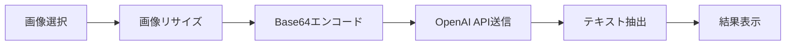

# 領収書OCRアプリケーション ハンズオンガイド

## 📌 概要

このプロジェクトは、OpenAI Vision APIを使用して領収書画像からテキストを抽出するWebアプリケーションです。ブラウザだけで動作し、サーバー構築は不要です。

### 主な機能
- 📷 領収書画像のテキスト認識（OCR）
- 🌐 多言語対応（日本語・英語・韓国語）と自動翻訳
- 📋 認識結果のコピー＆保存機能
- 🎯 ドラッグ＆ドロップ対応

## 🚀 クイックスタート

### 1. 必要なもの
- モダンブラウザ（Chrome、Firefox、Safari、Edge）
- OpenAI APIキー（[取得方法](#openai-apiキーの取得方法)参照）
- テキストエディタ（VS Code推奨）

### 2. セットアップ手順

#### Step 1: プロジェクトのダウンロード
GitHubからZipファイルダウンロード。

#### Step 2: ローカルサーバーの起動

**VS Code を使用する場合（推奨）：**
1. VS Codeでプロジェクトフォルダを開く
2. 拡張機能「Live Server」をインストール
3. `index.html`を右クリック → 「Open with Live Server」を選択
4. ブラウザが自動的に開きます（http://localhost:5500）

**その他の方法：**
```bash
# Python3を使用
python3 -m http.server 8000

# Node.jsを使用（http-serverがインストール済みの場合）
npx http-server
```

#### Step 3: アプリケーションの動作確認
1. ブラウザで `http://localhost:5500` を開く
2. 画面が正しく表示されることを確認

## 📖 使い方ガイド

### 基本的な使用手順

#### 1️⃣ OpenAI APIキーの入力
```
1. 画面中央の「OpenAI API Key」欄にAPIキーを入力
2. キーは「sk-」で始まる文字列です
3. ブラウザに安全に保存されます
```

#### 2️⃣ 画像のアップロード

**方法A: ドラッグ＆ドロップ**
- 領収書画像を破線のエリアにドラッグ＆ドロップ

**方法B: ファイル選択**
- 「画像を選択」ボタンをクリックして画像を選択

> 📝 対応形式：PNG、JPEG

#### 3️⃣ 言語の選択
画面右上の言語選択メニューから選択：
- 🇯🇵 日本語（ja）
- 🇺🇸 English (en)
- 🇰🇷 한국어 (ko)

#### 4️⃣ OCR実行
1. 「OCR開始」ボタンをクリック
2. 進捗バーで処理状況を確認
3. 数秒〜十数秒で結果が表示されます

#### 5️⃣ 結果の活用
- **コピー**: 「コピー」ボタンでクリップボードへ
- **保存**: 「.txtとして保存」ボタンでファイルダウンロード

## 🔧 技術的な詳細

### ファイル構成
```
cursor-handson/
├── index.html          # メインHTML（UI構造）
├── app.js             # JavaScript処理ロジック
├── assets/            # 画像リソース
│   └── IMG_0152.jpg   # サンプル画像
├── _llm-docs/         # ドキュメント
│   └── requirements.md # 要件定義書
└── README.md          # このファイル
```

### 使用技術
- **フロントエンド**: HTML5, JavaScript (ES6+)
- **スタイリング**: Tailwind CSS (CDN版)
- **OCR API**: OpenAI Vision API (gpt-5-nano-2025-08-07)
- **画像処理**: Canvas API

### 処理の流れ


## 🎯 ハンズオン課題

### 初級編
1. **基本動作の確認**
   - サンプル画像（assets/IMG_0152.jpg）でOCRを実行
   - 結果をコピーして、メモ帳に貼り付け
   - テキストファイルとして保存

2. **多言語対応の確認**
   - 同じ画像で言語を変更してOCR実行
   - 翻訳結果の違いを確認

### 中級編
3. **UIのカスタマイズ** (app.js編集)
   - トースト通知の表示時間を変更（3秒→5秒）
   - ファイル: `app.js` 85行目付近

4. **画像サイズ制限の変更**
   - 最大サイズを2000px→1500pxに変更
   - ファイル: `app.js` 107行目

### 上級編
5. **新機能の追加**
   - 認識結果の文字数カウント表示
   - 履歴機能（最後の5件を保存）
   - CSVエクスポート機能

## 🔑 OpenAI APIキーの取得方法

1. [OpenAI Platform](https://platform.openai.com/)にアクセス
2. アカウント作成またはログイン
3. 右上のプロフィール → 「API keys」を選択
4. 「Create new secret key」をクリック
5. キーをコピーして安全に保管

> ⚠️ **注意**: APIキーは他人と共有しないでください

## 🐛 トラブルシューティング

### よくある問題と解決方法

| 問題 | 原因 | 解決方法 |
|------|------|----------|
| 画像が表示されない | ファイル形式が非対応 | PNG/JPEG形式を使用 |
| OCRが失敗する | APIキーが無効 | 正しいAPIキーを入力 |
| 結果が文字化けする | エンコーディングの問題 | ブラウザを再起動 |
| 処理が遅い | 画像サイズが大きい | 自動的にリサイズされます |

### エラーメッセージ対応表

- `OpenAI API error: 401` → APIキーが無効です
- `OpenAI API error: 429` → API利用制限に達しました
- `OpenAI API error: 500` → サーバーエラー（時間をおいて再試行）

## 📚 参考資料

- [OpenAI Vision API ドキュメント](https://platform.openai.com/docs/guides/vision)
- [Tailwind CSS](https://tailwindcss.com/)
- [MDN Web Docs - Canvas API](https://developer.mozilla.org/ja/docs/Web/API/Canvas_API)

## 💡 開発のヒント

### コードの主要部分

**画像処理部分** (app.js:106-136)
```javascript
// 画像をキャンバスに描画し、リサイズ
function drawImageToCanvas(imageBitmap) {
    const maxSide = 2000; // 最大サイズ
    // ... リサイズ処理
}
```

**OCR実行部分** (app.js:138-241)
```javascript
// OpenAI APIを呼び出してOCR実行
async function runOCR() {
    // APIキーの確認
    // 画像のエンコード
    // API呼び出し
    // 結果の表示
}
```

### カスタマイズのポイント

1. **UIの色を変更したい場合**
   - `index.html`のTailwindクラスを編集
   - 例: `bg-blue-600` → `bg-green-600`

2. **新しい言語を追加したい場合**
   - `index.html` 28-32行目に`<option>`追加
   - `app.js` 156-160行目にプロンプト追加

3. **画像の前処理を追加したい場合**
   - `app.js`の`drawImageToCanvas`関数を拡張
   - グレースケール変換、コントラスト調整など

## 📄 ライセンス

このプロジェクトはMITライセンスの下で公開されています。

---
